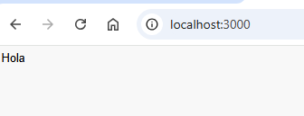
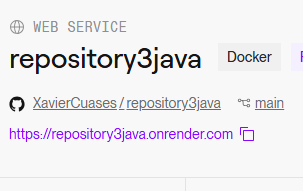
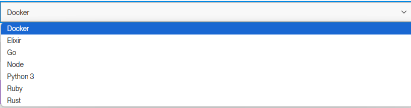
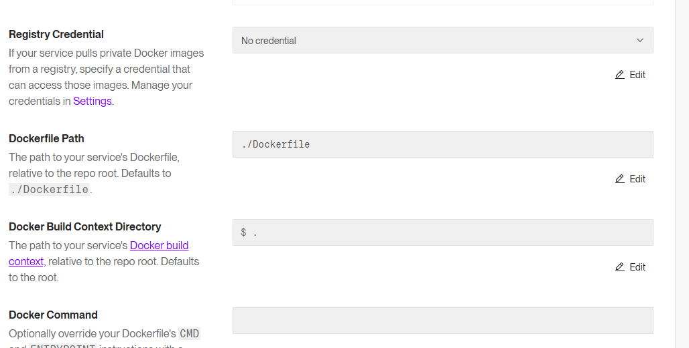

#  Hello with java spring
## Results
<p align="center">
   
</p>

This "Hello World" application uses Java Spring to start a basic web server that listens on port 3000. When a user navigates to http://localhost:3000, the server responds with an HTML page displaying a "Hello" message. Java Spring manages the server setup and routing, while JavaScript in the HTML file dynamically updates the DOM to show the message to the user.

## :open_book: How to use
* Clone the repository

    ```
    git clone https://github.com/XavierCuases/repository3java.git
    ```
> [!NOTE]
To run the "Hello World" project with Java Spring, first clone the repository and make sure you have Java JDK and Spring Boot installed on your machine. Open the project in a supported IDE such as IntelliJ IDEA, Eclipse, or VS Code, and build it using Maven or Gradle. Once the project is built, run the application with the appropriate command (mvn spring-boot:run for Maven or gradle bootRun for Gradle), which will start the server at http://localhost:3000. When you access this URL from your browser, you will see an HTML page that includes JavaScript code, which manipulates the DOM directly in the browser to display the message "Hello", without the need to make new requests to the server, thus improving the user experience .

## :rocket: How to run in docker
### Pre-requisites
* Docker - DockerDesktop installed
* DockerHub account

### link image docker hub 

### Download image

[ImagenJAVA](https://hub.docker.com/r/xaviercuases/ejercicio3java "click for visit")

The link will be for the image to be able to download it
```
docker pull xaviercuases/ejercicio3java
```
> [!IMPORTANT]
> JAVA SPRING, by default, runs on port 3000 when using its built-in development server. This is intended for local development and testing purposes. If you need to change the port, Flask allows you to specify a different one when running the application.
### Run image
```
docker run --name <NEWCONTAINERNAME> -d -p 3000:8080 <IMAGENAME>
```
> [!TIP]
> The name of the downloaded image must match the one placed in the previous command, for this you can verify it using the **docker images** command. Additionally, you must check that there is no other container with the same name as the one placed in the command.
### View the results
Open new window browser and search localhost:3000

[View results](#results)

## :light_rail: PAAS Deploy with docker (render)
For its deployment in a PAAS we will rely on Render and its easy implementation thanks to its container management. 



This project is deployed on Render, which supports multiple programming languages, including Docker, Elixir, Go, Node.js, Python 3 (used in this project), Ruby, and Rust. Although Render does not support Java directly, this project uses Docker to containerize the application, allowing it to be deployed seamlessly. Simply select "Docker" during deployment, connect your repository, and follow Render’s setup instructions to deploy the project. This approach ensures that the application can run in any environment that supports Docker, including Render’s infrastructure.



> [!IMPORTANT]
> Next, This project is configured to deploy on Render with the following settings:

This setup specifies that Docker will use the ./Dockerfile located in the root directory to build the image, with the entire repository as the build context ($ .). No registry credentials are provided, so it’s assumed that either public images are used or authentication isn’t required. The Docker Command field is left empty, so the container will use the CMD or ENTRYPOINT defined in the Dockerfile to run the application.




## Link servidor PASS

[Hello World](https://repository3java.onrender.com "click for visit")
